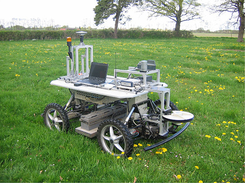
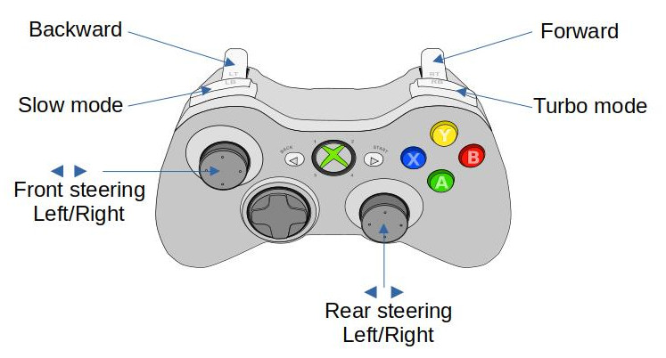
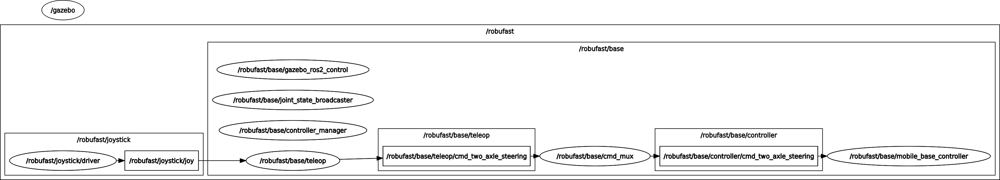

# robucar_bringup #

## 1 Launch files ##

The robucar_bringup package provides a suite of launch files enabling both manual and automated control of  Robufast robot, either in real-time or in simulation. 



### 1.1 Base launch file ###

The **robufast_base.launch.py** file, located in the launch directory, is responsible for starting the controller manager, the robot's controller, and a command multiplexer. The configuration of the controller manager and the robot controller are defined in the **controller_manager.yaml** and **mobile_base_controller.yaml** files, respectively, which are located in the config directory. By default, the **MobileBaseController2AS4WD** controller, provided by the **romea_mobile_base_controller** package, is used to operate Robufast robots.

You can launch these nodes via command line:

```console
ros2 launch robucar_bringup robucar_base_launch.py mode:=simulation robot_namespace:=adap2e base_name:=base
```

where:
- ***mode*** (choices: ***simulation*** or ***live***) defines the demonstration mode.  
- ***robot_namespace*** (default: ***robufast***) sets the main ROS namespace where all Robufast nodes are launched. 
- ***base_name*** (default: ***base***) sets the ROS sub-namespace in which controller nodes are launched

### 1.2 Teleop launch file ###

The **robucar_teleop.launch.py** file, located in the launch directory, is used to execute the **two_axle_steering_teleop_node** provided by the **romea_teleop_drivers** package to control the motion of the Robufast robot. You can launch the teleop node via the command line:

```console
ros2 launch robucar_bringup robucar_teleop.launch.py joystick_type:=xbox joystick_driver:=joy joystic_topic:=joystick/joy teleop_configuration_file_path:=/path_to_file/teleop.yaml
```

where:

- ***joystick_type*** (choices: ***xbox*** or ***dualshock4***) specifies the type of joystick
- ***joystick_driver*** (choices: ***joy*** or ***ds4_driver***, default: ***joy***) defines the ROS2 driver package used to control the joystick
- ***joystic_topic*** (default: **joystick/joy**) defines the name of the output topic of the  joystick node 
- ***teleop_configuration_file_path*** specifies the absolute path of teleoperation configuration file 

The default teleop configuration file can be found in the config directory of the **aroco_description** package, and the joystick mapping can be found in the config directory of the **romea_teleop_description** package. To move the robot, hold down either the slow mode or turbo mode button. Use the control sticks to adjust the front and rear steering angles, and the triggers to control the robot's speed.



## 2.3 Test launch file

The **robucar_test.launch.py** file, located in the launch directory, is used to test the robot control pipeline in both live and simulation contexts. The following nodes are launched: controller manager, robot controller, joystick node, and teleop node using an Xbox joystick.

```console
ros2 launch aroco_bringup aroco_test.launch.py robot_model:=fat mode:=simulation
```

where:

- ***mode*** (choices: ***simulation*** or ***live***) defines the demonstration mode

Below, you can see the ROS pipeline when selecting the simulation mode. In live mode, the pipeline remains the same, except that the **gazebo_ros2_controller_manager** is replaced by a standard **ros2_controller_manager**.



# 2 URDF description:

You can generate the URDF description of the Robufast robot using the **urdf_description.py** executable located in the scripts directory.

```console
ros2 run robucar_bringup urdf_description.py mode:simulation base_name:base robot_namespace:robufast > robufast.urdf
```

where:

- ***base_name***  defines the name of robot mobile base  
- ***mode*** (choices: ***simulation*** or ***live***) defines the demonstration mode,
- **robot_namespace** is the namespace in which the ROS2 nodes are launched. It is also used as a prefix for link and joints of the mobile base. 
